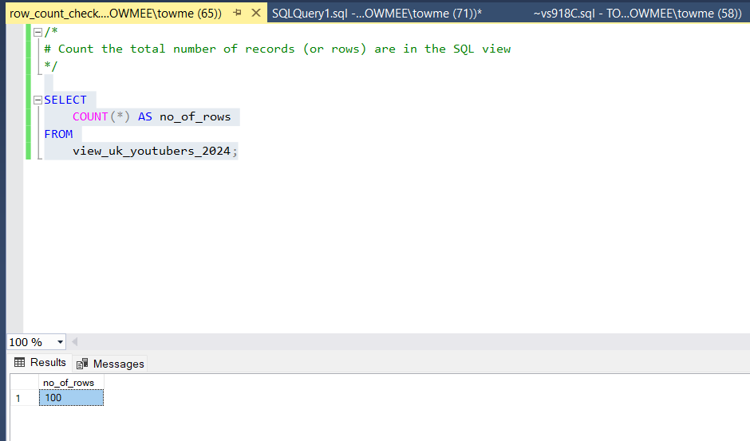
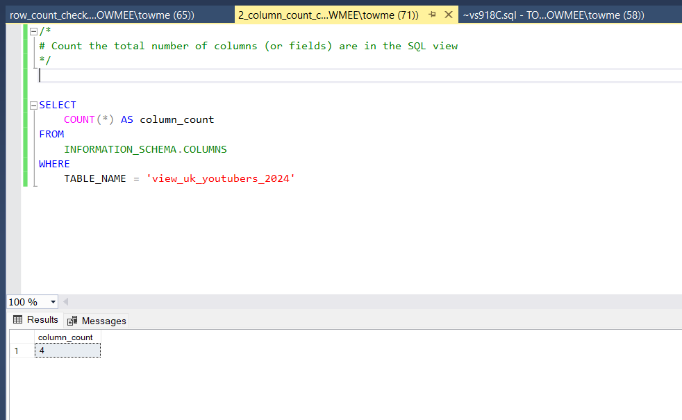
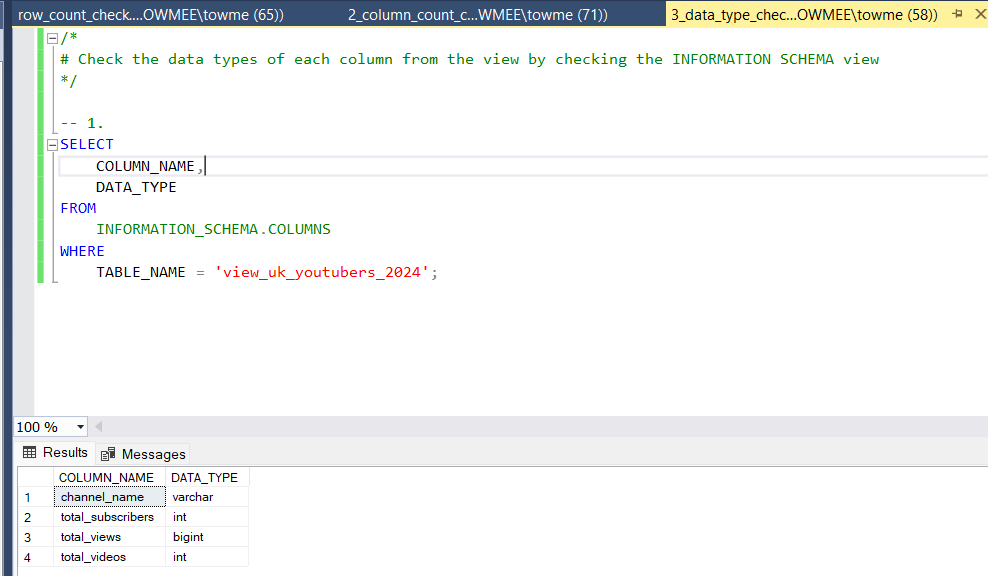
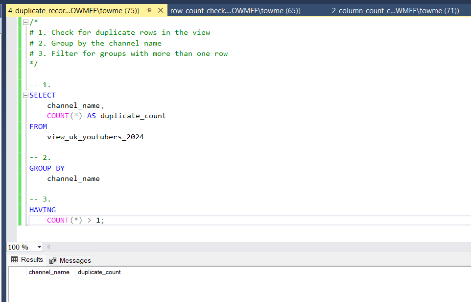
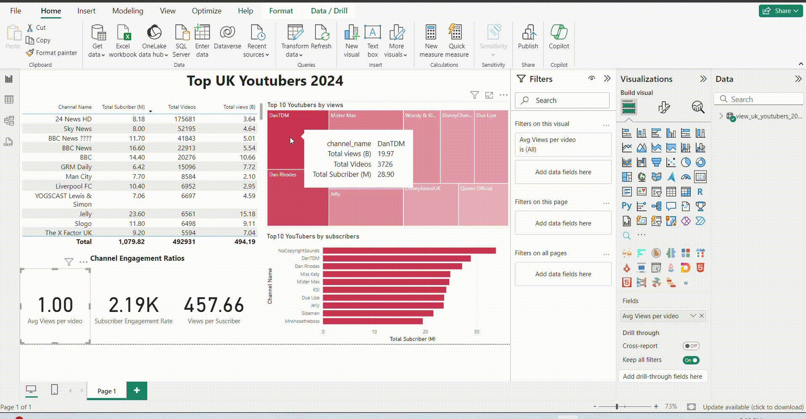
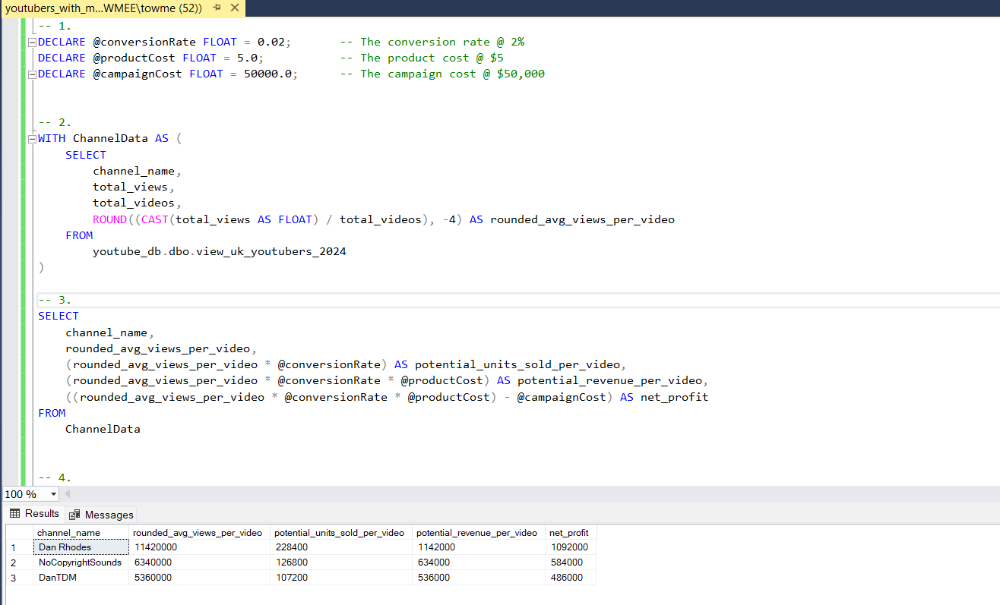
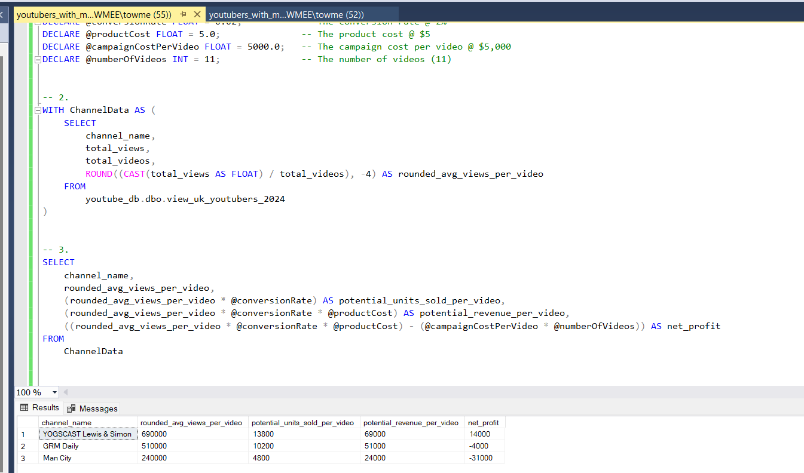
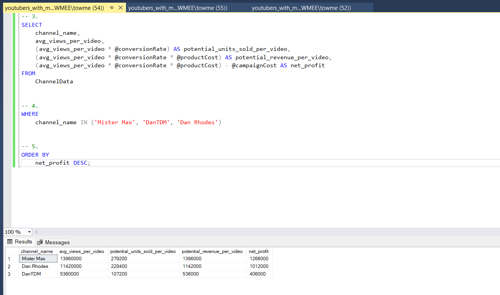

# Data Portfolio: Excel to Power BI 


[Data project 1 - Youtube use ](https://olatomiadigun.github.io/youtube_project/)


# Table of contents 

- [Objective](#objective)
- [Data Source](#data-source)
- [Stages](#stages)
- [Design](#design)
  - [Mockup](#mockup)
  - [Tools](#tools)
- [Development](#development)
  - [Pseudocode](#pseudocode)
  - [Data Exploration](#data-exploration)
  - [Data Cleaning](#data-cleaning)
  - [Transform the Data](#transform-the-data)
  - [Create the SQL View](#create-the-sql-view)
- [Testing](#testing)
  - [Data Quality Tests](#data-quality-tests)
- [Visualization](#visualization)
  - [Results](#results)
  - [DAX Measures](#dax-measures)
- [Analysis](#analysis)
  - [Findings](#findings)
  - [Validation](#validation)
  - [Discovery](#discovery)
- [Recommendations](#recommendations)
  - [Potential ROI](#potential-roi)
  - [Potential Courses of Actions](#potential-courses-of-actions)
- [Conclusion](#conclusion)


# Objective 

- What is the key main point? 

The Head of Marketing wants to find out who the top YouTubers are in 2024 to decide on which YouTubers would be best to run marketing campaigns throughout the rest of the year.


- What is the ideal solution? 

To create a dashboard that provides insights into the top UK YouTubers in 2024 that includes their 
- subscriber count
- total views
- total videos, and
- engagement metrics

This will help the marketing team make informed decisions about which YouTubers to collaborate with for their marketing campaigns.

## User story 

As the Head of Marketing, I want to use a dashboard that analyses YouTube channel data in the UK . 

This dashboard should allow me to identify the top performing channels based on metrics like subscriber base and average views. 

With this information, I can make more informed decisions about which Youtubers are right to collaborate with, and therefore maximize how effective each marketing campaign is.


# Data source 

- What data is needed to achieve our objective?

We need data on the top UK YouTubers in 2024 that includes their 
- channel names
- total subscribers
- total views
- total videos uploaded


- Where is the data coming from? 
The data is sourced from Kaggle (an Excel extract), [see here to find it.](https://www.kaggle.com/datasets/bhavyadhingra00020/top-100-social-media-influencers-2024-countrywise?resource=download)


# Stages

- Design
- Developement
- Testing
- Analysis 
 


# Design 

## Dashboard components required 
- What should the dashboard contain based on the requirements provided?

To understand what it should contain, we need to figure out what questions we need the dashboard to answer:

1. Who are the top 10 YouTubers with the most subscribers?
2. Which 3 channels have uploaded the most videos?
3. Which 3 channels have the most views?
4. Which 3 channels have the highest average views per video?
5. Which 3 channels have the highest views per subscriber ratio?
6. Which 3 channels have the highest subscriber engagement rate per video uploaded?

For now, these are some of the questions we need to answer, this may change as we progress down our analysis. 


## Dashboard mockup

- What should it look like? 

Some of the data visuals that may be appropriate in answering our questions include:

1. Table
2. Treemap
3. Scorecards
4. Horizontal bar chart 


## Tools 


| Tool | Purpose |
| --- | --- |
| Excel | Exploring the data |
| SQL Server | Cleaning, testing, and analyzing the data |
| Power BI | Visualizing the data via interactive dashboards |
| GitHub | Hosting the project documentation and version control |
| Mokkup AI | Designing the wireframe/mockup of the dashboard | 


# Development

## Pseudocode

- What's the general approach in creating this solution from start to finish?

1. Get the data
2. Explore the data in Excel
3. Load the data into SQL Server
4. Clean the data with SQL
5. Test the data with SQL
6. Visualize the data in Power BI
7. Generate the findings based on the insights
8. Write the documentation + commentary
9. Publish the data to GitHub Pages

## Data exploration notes

This is the stage where you have a scan of what's in the data, errors, inconcsistencies, bugs, weird and corrupted characters etc  


- What are your initial observations with this dataset? What's caught your attention so far? 

1. There are at least 4 columns that contain the data we need for this analysis, which signals we have everything we need from the file without needing to contact the client for any more data. 
2. The first column contains the channel ID with what appears to be channel IDS, which are separated by a @ symbol - we need to extract the channel names from this.
3. Some of the cells and header names are in a different language - we need to confirm if these columns are needed, and if so, we need to address them.
4. We have more data than we need, so some of these columns would need to be removed


## Data cleaning 
- What do we expect the clean data to look like? (What should it contain? What constraints should we apply to it?)

The aim is to refine our dataset to ensure it is structured and ready for analysis. 

The cleaned data should meet the following criteria and constraints:

- Only relevant columns should be retained.
- All data types should be appropriate for the contents of each column.
- No column should contain null values, indicating complete data for all records.

Below is a table outlining the constraints on our cleaned dataset:

| Property | Description |
| --- | --- |
| Number of Rows | 100 |
| Number of Columns | 4 |

And here is a tabular representation of the expected schema for the clean data:

| Column Name | Data Type | Nullable |
| --- | --- | --- |
| channel_name | VARCHAR | NO |
| total_subscribers | INTEGER | NO |
| total_views | INTEGER | NO |
| total_videos | INTEGER | NO |


- What steps are needed to clean and shape the data into the desired format?

1. Remove unnecessary columns by only selecting the ones you need
2. Extract Youtube channel names from the first column
3. Rename columns using aliases


### Transform the data 


```sql
/*
# 1. Select the required columns
# 2. Extract the channel name from the 'NOMBRE' column
*/

-- 1.
SELECT
    SUBSTRING(NOMBRE, 1, CHARINDEX('@', NOMBRE) -1) AS channel_name,  -- 2.
    total_subscribers,
    total_views,
    total_videos

FROM
    top_uk_youtubers_2024
```


### Create the SQL view 

```sql
/*
# 1. Create a view to store the transformed data
# 2. Cast the extracted channel name as VARCHAR(100)
# 3. Select the required columns from the top_uk_youtubers_2024 SQL table 
*/

-- 1.
CREATE VIEW view_uk_youtubers_2024 AS

-- 2.
SELECT
    CAST(SUBSTRING(NOMBRE, 1, CHARINDEX('@', NOMBRE) -1) AS VARCHAR(100)) AS channel_name, -- 2. 
    total_subscribers,
    total_views,
    total_videos

-- 3.
FROM
    top_uk_youtubers_2024

```


# Testing 

- What data quality and validation checks are you going to create?

Here are the data quality tests conducted:

## Row count check
```sql
/*
# Count the total number of records (or rows) are in the SQL view
*/

SELECT
    COUNT(*) AS no_of_rows
FROM
    view_uk_youtubers_2024;

```




## Column count check
### SQL query 
```sql
/*
# Count the total number of columns (or fields) are in the SQL view
*/


SELECT
    COUNT(*) AS column_count
FROM
    INFORMATION_SCHEMA.COLUMNS
WHERE
    TABLE_NAME = 'view_uk_youtubers_2024'
```
### Output 



## Data type check
### SQL query 
```sql
/*
# Check the data types of each column from the view by checking the INFORMATION SCHEMA view
*/

-- 1.
SELECT
    COLUMN_NAME,
    DATA_TYPE
FROM
    INFORMATION_SCHEMA.COLUMNS
WHERE
    TABLE_NAME = 'view_uk_youtubers_2024';
```
### Output



## Duplicate count check
### SQL query 
```sql
/*
# 1. Check for duplicate rows in the view
# 2. Group by the channel name
# 3. Filter for groups with more than one row
*/

-- 1.
SELECT
    channel_name,
    COUNT(*) AS duplicate_count
FROM
    view_uk_youtubers_2024

-- 2.
GROUP BY
    channel_name

-- 3.
HAVING
    COUNT(*) > 1;
```
### Output


# Visualization 


## Results

- What does the dashboard look like?



This shows the Top UK Youtubers in 2024 so far. 


## DAX Measures

### 1. Total Subscribers (M)
```sql
Total Subscribers (M) = 
VAR million = 1000000
VAR sumOfSubscribers = SUM(view_uk_youtubers_2024[total_subscribers])
VAR totalSubscribers = DIVIDE(sumOfSubscribers,million)

RETURN totalSubscribers

```

### 2. Total Views (B)
```sql
Total Views (B) = 
VAR billion = 1000000000
VAR sumOfTotalViews = SUM(view_uk_youtubers_2024[total_views])
VAR totalViews = ROUND(sumOfTotalViews / billion, 2)

RETURN totalViews

```

### 3. Total Videos
```sql
Total Videos = 
VAR totalVideos = SUM(view_uk_youtubers_2024[total_videos])

RETURN totalVideos

```

### 4. Average Views Per Video (M)
```sql
Average Views per Video (M) = 
VAR sumOfTotalViews = SUM(view_uk_youtubers_2024[total_views])
VAR sumOfTotalVideos = SUM(view_uk_youtubers_2024[total_videos])
VAR  avgViewsPerVideo = DIVIDE(sumOfTotalViews,sumOfTotalVideos, BLANK())
VAR finalAvgViewsPerVideo = DIVIDE(avgViewsPerVideo, 1000000, BLANK())

RETURN finalAvgViewsPerVideo 

```


### 5. Subscriber Engagement Rate
```sql
Subscriber Engagement Rate = 
VAR sumOfTotalSubscribers = SUM(view_uk_youtubers_2024[total_subscribers])
VAR sumOfTotalVideos = SUM(view_uk_youtubers_2024[total_videos])
VAR subscriberEngRate = DIVIDE(sumOfTotalSubscribers, sumOfTotalVideos, BLANK())

RETURN subscriberEngRate 

```


### 6. Views per subscriber
```sql
Views Per Subscriber = 
VAR sumOfTotalViews = SUM(view_uk_youtubers_2024[total_views])
VAR sumOfTotalSubscribers = SUM(view_uk_youtubers_2024[total_subscribers])
VAR viewsPerSubscriber = DIVIDE(sumOfTotalViews, sumOfTotalSubscribers, BLANK())

RETURN viewsPerSubscriber 

```


# Analysis 

## Findings

- What did we find?

For this analysis, we're going to focus on the questions below to get the information we need for our marketing client - 

Here are the key questions we need to answer for our marketing client: 
1. Who are the top 10 YouTubers with the most subscribers?
2. Which 3 channels have uploaded the most videos?
3. Which 3 channels have the most views?
4. Which 3 channels have the highest average views per video?
5. Which 3 channels have the highest views per subscriber ratio?
6. Which 3 channels have the highest subscriber engagement rate per video uploaded?


### 1. Who are the top 10 YouTubers with the most subscribers?

| Rank | Channel Name         | Subscribers (M) |
|------|----------------------|-----------------|
| 1    | NoCopyrightSounds    | 33.80           |
| 2    | DanTDM               | 28.90           |
| 3    | Dan Rhodes           | 27.20           |
| 4    | Miss Katy            | 24.90           |
| 5    | Mister Max           | 24.70           |
| 6    | KSI                  | 24.10           |
| 7    | Dua Lipa             | 23.70           |
| 8    | Jelly                | 23.60           |
| 9    | Sidemen              | 21.60           |
| 10   | Mrwhosetheboss       | 19.50           |


### 2. Which 3 channels have uploaded the most videos?

| Rank | Channel Name    | Videos Uploaded |
|------|-----------------|-----------------|
| 1    | GRM Daily       | 15,096          |
| 2    | Manchester City | 8,584           |
| 3    | Yogscast        | 6,697           |


### 3. Which 3 channels have the most views?


| Rank | Channel Name | Total Views (B) |
|------|--------------|-----------------|
| 1    | DanTDM       | 19.97           |
| 2    | Dan Rhodes   | 19.06           |
| 3    | Mister Max   | 16.22           |


### 4. Which 3 channels have the highest average views per video?

| Channel Name | Averge Views per Video (M) |
|--------------|-----------------|
| Mark Ronson  | 33.60           |
| Jessie J     | 6.16            |
| Dua Lipa     | 4.85            |


### 5. Which 3 channels have the highest views per subscriber ratio?

| Rank | Channel Name       | Views per Subscriber        |
|------|-----------------   |---------------------------- |
| 1    | GRM Daily          | 1203.15  '                  |
| 2    | Nickelodeon        | 1062.81                     |
| 3    | Disney Junior UK   | 1035.80                     |


### 6. Which 3 channels have the highest subscriber engagement rate per video uploaded?

| Rank | Channel Name    | Subscriber Engagement Rate  |
|------|-----------------|---------------------------- |
| 1    | Mark Ronson     | 346,500                     |
| 2    | Jessie J        | 111,458.33                  |
| 3    | Dua Lipa        | 84,642.86                   |


### Notes

For this analysis, we'll prioritize analysing the metrics that are important in generating the expected ROI for our marketing client, which are the YouTube channels wuth the most 

- subscribers
- total views
- videos uploaded


## Validation 

### 1. Youtubers with the most subscribers 

#### Calculation breakdown

Campaign idea = product placement 

1. NoCopyrightSounds 
- Average views per video = 6.34 million
- Product cost = $5
- Potential units sold per video = 6.34 million x 2% conversion rate = 126,800 units sold
- Potential revenue per video = 126,800 x $5 = $634,000
- Campaign cost (one-time fee) = $50,000
- **Net profit = $634,000 - $50,000 = $584,000**

b. DanTDM

- Average views per video = 5.36 million
- Product cost = $5
- Potential units sold per video = 5.36 million x 2% conversion rate = 107,200 units sold
- Potential revenue per video = 107,200 x $5 = $536,000
- Campaign cost (one-time fee) = $50,000
- **Net profit = $536,000 - $50,000 = $486,000**

c. Dan Rhodes

- Average views per video = 11.42 million
- Product cost = $5
- Potential units sold per video = 11.42 million x 2% conversion rate = 228,400 units sold
- Potential revenue per video = 228,400 x $5 = $1,142,000
- Campaign cost (one-time fee) = $50,000
- **Net profit = $1,142,000 - $50,000 = $1,092,000**


Best option from category: Dan Rhodes


#### SQL query 

```sql
/* 

# 1. Define variables 
# 2. Create a CTE that rounds the average views per video 
# 3. Select the column you need and create calculated columns from existing ones 
# 4. Filter results by Youtube channels
# 5. Sort results by net profits (from highest to lowest)

*/


-- 1. 
DECLARE @conversionRate FLOAT = 0.02;		-- The conversion rate @ 2%
DECLARE @productCost FLOAT = 5.0;			-- The product cost @ $5
DECLARE @campaignCost FLOAT = 50000.0;		-- The campaign cost @ $50,000	


-- 2.  
WITH ChannelData AS (
    SELECT 
        channel_name,
        total_views,
        total_videos,
        ROUND((CAST(total_views AS FLOAT) / total_videos), -4) AS rounded_avg_views_per_video
    FROM 
        youtube_db.dbo.view_uk_youtubers_2024
)

-- 3. 
SELECT 
    channel_name,
    rounded_avg_views_per_video,
    (rounded_avg_views_per_video * @conversionRate) AS potential_units_sold_per_video,
    (rounded_avg_views_per_video * @conversionRate * @productCost) AS potential_revenue_per_video,
    ((rounded_avg_views_per_video * @conversionRate * @productCost) - @campaignCost) AS net_profit
FROM 
    ChannelData


-- 4. 
WHERE 
    channel_name in ('NoCopyrightSounds', 'DanTDM', 'Dan Rhodes')    


-- 5.  
ORDER BY
	net_profit DESC

```

#### Output



### 2. Youtubers with the most videos uploaded

### Calculation breakdown 

Campaign idea = sponsored video series  

1. GRM Daily
- Average views per video = 510,000
- Product cost = $5
- Potential units sold per video = 510,000 x 2% conversion rate = 10,200 units sold
- Potential revenue per video = 10,200 x $5= $51,000
- Campaign cost (11-videos @ $5,000 each) = $55,000
- **Net profit = $51,000 - $55,000 = -$4,000 (potential loss)**

b. **Manchester City**

- Average views per video = 240,000
- Product cost = $5
- Potential units sold per video = 240,000 x 2% conversion rate = 4,800 units sold
- Potential revenue per video = 4,800 x $5= $24,000
- Campaign cost (11-videos @ $5,000 each) = $55,000
- **Net profit = $24,000 - $55,000 = -$31,000 (potential loss)**

c. **Yogscast**

- Average views per video = 690,000
- Product cost = $5
- Potential units sold per video = 690,000 x 2% conversion rate = 13,800 units sold
- Potential revenue per video = 13,800 x $5= $69,000
- Campaign cost (11-videos @ $5,000 each) = $55,000
- **Net profit = $69,000 - $55,000 = $14,000 (profit)**


Best option from category: Yogscast

#### SQL query 
```sql
/* 
# 1. Define variables
# 2. Create a CTE that rounds the average views per video
# 3. Select the columns you need and create calculated columns from existing ones
# 4. Filter results by YouTube channels
# 5. Sort results by net profits (from highest to lowest)
*/


-- 1.
DECLARE @conversionRate FLOAT = 0.02;           -- The conversion rate @ 2%
DECLARE @productCost FLOAT = 5.0;               -- The product cost @ $5
DECLARE @campaignCostPerVideo FLOAT = 5000.0;   -- The campaign cost per video @ $5,000
DECLARE @numberOfVideos INT = 11;               -- The number of videos (11)


-- 2.
WITH ChannelData AS (
    SELECT
        channel_name,
        total_views,
        total_videos,
        ROUND((CAST(total_views AS FLOAT) / total_videos), -4) AS rounded_avg_views_per_video
    FROM
        youtube_db.dbo.view_uk_youtubers_2024
)


-- 3.
SELECT
    channel_name,
    rounded_avg_views_per_video,
    (rounded_avg_views_per_video * @conversionRate) AS potential_units_sold_per_video,
    (rounded_avg_views_per_video * @conversionRate * @productCost) AS potential_revenue_per_video,
    ((rounded_avg_views_per_video * @conversionRate * @productCost) - (@campaignCostPerVideo * @numberOfVideos)) AS net_profit
FROM
    ChannelData


-- 4.
WHERE
    channel_name IN ('GRM Daily', 'Man City', 'YOGSCAST Lewis & Simon ')


-- 5.
ORDER BY
    net_profit DESC;
```

#### Output




### 3.  Youtubers with the most views 

#### Calculation breakdown

Campaign idea = Influencer marketing 

a. DanTDM

- Average views per video = 5.36 million
- Product cost = $5
- Potential units sold per video = 5.36 million x 2% conversion rate = 107,200 units sold
- Potential revenue per video = 107,200 x $5 = $536,000
- Campaign cost (3-month contract) = $130,000
- **Net profit = $536,000 - $130,000 = $406,000**

b. Dan Rhodes

- Average views per video = 11.42 million
- Product cost = $5
- Potential units sold per video = 11.42 million x 2% conversion rate = 228,400 units sold
- Potential revenue per video = 228,400 x $5 = $1,142,000
- Campaign cost (3-month contract) = $130,000
- **Net profit = $1,142,000 - $130,000 = $1,012,000**

c. Mister Max

- Average views per video = 13.96 million
- Product cost = $5
- Potential units sold per video = 13.96 million x 2% conversion rate = 279,200 units sold
- Potential revenue per video = 279,200 x $5 = $1,396,000
- Campaign cost (3-month contract) = $130,000
- **Net profit = $1,396,000 - $130,000 = $1,266,000**

Best option from category: Mister Max


#### SQL query 
```sql
/*
# 1. Define variables
# 2. Create a CTE that rounds the average views per video
# 3. Select the columns you need and create calculated columns from existing ones
# 4. Filter results by YouTube channels
# 5. Sort results by net profits (from highest to lowest)
*/


-- 1.
DECLARE @conversionRate FLOAT = 0.02;        -- The conversion rate @ 2%
DECLARE @productCost MONEY = 5.0;            -- The product cost @ $5
DECLARE @campaignCost MONEY = 130000.0;      -- The campaign cost @ $130,000


-- 2.
WITH ChannelData AS (
    SELECT
        channel_name,
        total_views,
        total_videos,
        ROUND(CAST(total_views AS FLOAT) / total_videos, -4) AS avg_views_per_video
    FROM
        youtube_db.dbo.view_uk_youtubers_2024
)


-- 3.
SELECT
    channel_name,
    avg_views_per_video,
    (avg_views_per_video * @conversionRate) AS potential_units_sold_per_video,
    (avg_views_per_video * @conversionRate * @productCost) AS potential_revenue_per_video,
    (avg_views_per_video * @conversionRate * @productCost) - @campaignCost AS net_profit
FROM
    ChannelData


-- 4.
WHERE
    channel_name IN ('Mister Max', 'DanTDM', 'Dan Rhodes')


-- 5.
ORDER BY
    net_profit DESC;

```

#### Output




## Discovery

- What did we learn?

We discovered that 


1. NoCopyrightSOunds, Dan Rhodes and DanTDM are the channnels with the most subscribers in the UK
2. GRM Daily, Man City and Yogscast are the channels with the most videos uploaded
3. DanTDM, Dan RHodes and Mister Max are the channels with the most views
4. Entertainment channels are useful for broader reach, as the channels posting consistently on their platforms and generating the most engagement are focus on entertainment and music 


## Recommendations 

- What do you recommend based on the insights gathered? 
  
1. Dan Rhodes presents the highest ROI among the top 3 YouTube channels by subscriber count in the UK. Collaborating with this channel will likely maximize both visibility and return on investment
2. While GRM Daily, Man City, and Yogcasts have the highest video output in the UK, their potential return on investment (ROI) is considerably lower compared to other channels. It may not be the most efficient use of resources to collaborate with these channels based on current metrics.
3. Mister Max has the highest average views per video, making it the best option for maximizing reach. However, for a more sustainable, long-term strategy, DanTDM and Dan Rhodes are strong alternatives due to their large subscriber bases and considerably high average views.
4. Based on engagement metrics, the top 3 channels to consider for collaboration are Mister Max, Dan Rhodes, and NoCopyrightSounds, as they consistently drive the most engagement across their content.
5. In cases where engagement and reach are closely matched, the tie can be broken by evaluating how well each channel aligns with the brand or product. Channels whose content and audience demographics better match the product’s target market should be prioritized for collaboration to ensure maximum relevance and impact


### Potential ROI 
- What ROI do we expect if we take this course of action?

1. Setting up a collaboration deal with Dan Rhodes would make the client a net profit of $1,065,000 per video
2. An influencer marketing contract with Mister Max can see the client generate a net profit of $1,276,000
3. If we go with a product placement campaign with DanTDM, this could  generate the client approximately $484,000 per video. If we advance with an influencer marketing campaign deal instead, this would make the client a one-off net profit of $404,000.
4. NoCopyrightSounds could profit the client $642,000 per video too (which is worth considering) 


### Action plan
- Recommended Course of Action and Rationale:

Based on our analysis, Mister Max is the most suitable channel for initiating a long-term partnership to promote the client's products. This recommendation is driven by Mister Max's strong average views per video and consistent engagement, making it ideal for maximizing reach and visibility.

We will also engage the marketing team to align on expectations for this collaboration. Once we confirm we're hitting the targeted KPIs and milestones, we can explore potential partnerships with DanTDM, Dan Rhodes, and NoCopyrightSounds for future campaigns to further enhance reach and engagement.

-Implementation Steps:

1. Initial Outreach:
Begin by reaching out to the teams behind the identified channels, starting with Mister Max, followed by Dan Rhodes, DanTDM, and NoCopyrightSounds.

2. Contract Negotiation:
Negotiate agreements within the allocated budgets for each marketing campaign, ensuring the terms align with both the client's objectives and the channel's audience reach.

3. Campaign Execution and Monitoring:
Launch the campaigns and closely track performance against predefined KPIs (views, engagements, conversions). This will allow real-time adjustments if necessary.

4. Post-Campaign Review and Optimization:
After the campaigns conclude, review results to gather insights. Evaluate both customer feedback and engagement data from each channel's audience, and optimize future strategies based on these findings.


